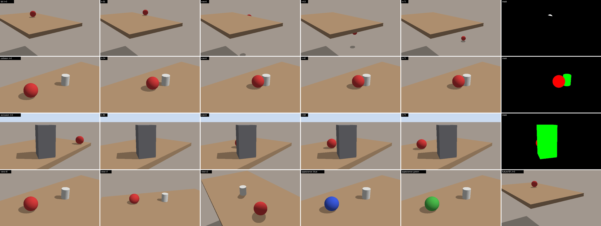
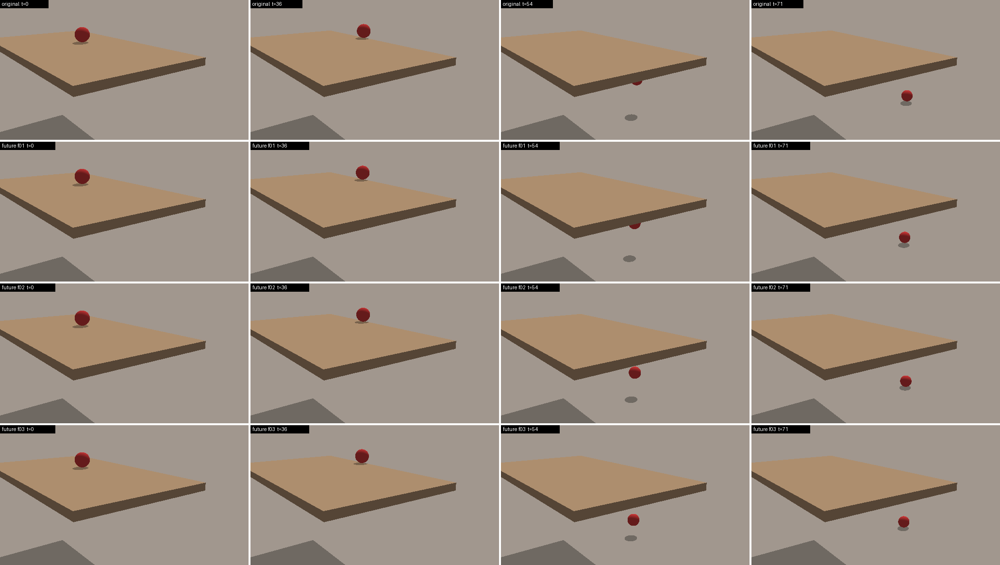

# PhysScene

**Automated, reproducible physics-event scene generation for Unreal Engine 5.**
PhysScene builds CRONOS-style counterfactual video benchmarks without manual
scene construction.

Recent benchmarks such as [CRONOS](https://arxiv.org/abs/2605.23699) evaluate
video models with *interventions*: a physical event (a fall, a collision, an
occlusion) is held fixed while the viewpoint, scene, object or appearance
changes. A newer question is how a model does against *multiple plausible
futures* from the same initial state. Unreal Engine gives the photorealism,
but in practice each scene is still placed, tuned and rendered **by hand**.
The generation parameters and simulator state are usually not released, so a
dataset cannot be extended or regenerated.
[Related work](docs/related_work.md) surveys this; we found no open tool that
automates it.

PhysScene turns a short YAML config into a fully rendered, verified,
reproducible dataset:

```
  catalog.yaml  +  level manifests  +  experiment.yaml
        │
        ▼  physscene plan
  event templates → MuJoCo simulation → push calibration → physics checks
  → event-aware cameras → visibility/occlusion checks → alternative futures
        │                     (all seeded & saved)
        ▼  physscene render --renderer unreal      (or --renderer preview: no UE needed)
  Level Sequences with baked keyframes → Movie Render Queue: RGB + masks + depth
        │
        ▼  physscene export / validate
  <event>/<scene>/<object>/<appearance>/<view>/{movies/complete.mp4, mask/, depth/, metadata.json,
                                                 camera.json, states.json, alternatives/f01/...}
```

<p align="center"><br>
<em>Preview renders from the starter experiment. Rows: fall / collision /
occlusion. Columns: frame 0 → the automatically detected event frame → end, and the mask.</em></p>

<p align="center"><br>
<em>Alternative futures: identical frame 0, resampled hidden physics (friction,
restitution, mass, surface friction, sub-perceptual push noise).</em></p>

## Features

* **No per-scene manual work.** Annotate each level once (tag the table actors,
  or write a few lines of YAML). Event templates place the objects, colliders
  and occluders.
* **Verified events.** Every proposal is simulated and checked. Did the object
  leave the table and land? Did it touch the collider? Was it actually hidden
  by the occluder, and did it reappear? The initial push is **calibrated
  automatically** until the event happens inside the clip's time window.
* **Identical physics across interventions.** The physics is simulated once
  (MuJoCo, deterministic) and **baked into Unreal keyframes**, so every
  viewpoint and appearance shows exactly the same motion.
* **Multiple futures.** `futures.count: N` resamples hidden physical
  parameters, keeps frame 0 identical, and re-verifies the event.
* **Full simulator state.** Every sample ships its layout, parameters,
  per-frame poses, Unreal keys and camera intrinsics and extrinsics.
* **CRONOS-compatible output.** `metadata.json`, `mask/frame_0000.jpg` and
  `movies/complete.mp4` follow the CRONOS evaluation code layout, and
  `cronos_config.json` gives the prompt dictionaries.
* **Runs anywhere.** The planner is pure Python (numpy + MuJoCo). The preview
  renderer lets you dry-run everything on a laptop or in CI. The Unreal
  driver uses the stock editor Python (no numpy) and headless Movie Render Queue.
* **Resumable, parallel, seeded.** The same config always gives the same
  dataset, and interrupted Unreal batches resume.

## Quick start (no Unreal needed)

```bash
git clone https://github.com/fender70/PhysScene && cd PhysScene
pip install -e ".[viz]"

# plan + preview-render + export + validate the starter experiment
physscene run configs/starter.yaml -o out/starter --renderer preview --workers 8 --limit 50

# or step by step
physscene plan configs/starter.yaml -o out/starter/plan --workers 8
physscene inspect out/starter/plan              # summary + top-down layout plots
physscene render out/starter/plan --renderer preview --workers 8
physscene export out/starter/plan -o out/starter/dataset
physscene validate out/starter/dataset
```

The starter experiment is 3 events × 2 scenes × 3 objects × 3 appearances ×
3 views × (1 + 3 futures) = **648 clips**. It plans in about 15 s on a laptop.

## Rendering in Unreal Engine 5

```bash
physscene render out/starter/plan --renderer unreal --uproject path/to/Project.uproject
```

The starter catalog uses only `/Engine/BasicShapes` and a stock template map,
so it renders in a blank project. For photoreal data, point the catalog at your
own assets and export level manifests from your levels. See
**[docs/unreal_setup.md](docs/unreal_setup.md)**, and
[`configs/cronos_like.yaml`](configs/cronos_like.yaml) for a CRONOS-shaped
template (Can / TennisBall / ToyTruck / SoccerBall / Bottle, 3 appearances each).

## Configuration at a glance

```yaml
# experiment.yaml
catalog: catalog.yaml            # objects & props: UE mesh, materials per appearance, collision proxy, physics
levels: [levels/kitchen.yaml]    # UE map + support surfaces (+ colliders, camera limits)
design:
  events: [fall, collision, occlusion]
  objects: [TennisBall, Can]
  appearances: all
  views: 3
  sampling: full                 # or N random cells of the factorial grid
render: {fps: 16, num_frames: 81, resolution: [1280, 720], passes: [rgb, mask, depth]}
futures:
  count: 4
  perturb: {friction: {rel: 0.3}, restitution: {rel: 0.3}, mass: {rel: 0.3}, initial_speed: {rel: 0.05}}
events:
  fall: {distance_to_edge: [0.2, 0.5]}
checks:
  event_window: [0.12, 0.88]     # the key moment must happen inside this part of the clip
```

## Repository layout

```
physscene/           planner (pure Python)
  events.py          event templates (fall, collision, occlusion; register your own)
  physics/           MuJoCo backend (Unreal-style friction/restitution combine modes)
  camera.py          event-aware static camera sampling
  checks.py          physics + visibility verification
  planner.py         design grid, rejection sampling, push calibration, futures, job writer
  preview.py         numpy ray-cast preview renderer
  export.py          raw renders → dataset (mp4, masks, depth, camera, states)
  validate.py        dataset checks (incl. CRONOS compatibility)
unreal/              runs inside Unreal Editor (Python Editor Script Plugin)
  run_jobs.py        batch entry point
  physscene_ue/      sequence builder, MRQ driver, materials, level manifest export
configs/             starter experiment (engine shapes) + CRONOS-style templates
docs/                related work, UE setup, data format, extending
tests/               unit + end-to-end tests (incl. the UE driver against a mocked `unreal`)
```

## Documentation

* [Related work & the automation gap](docs/related_work.md)
* [Unreal Engine setup](docs/unreal_setup.md)
* [Data format & conventions](docs/data_format.md)
* [Extending: new events, interventions, backends, renderers](docs/extending.md)

## Status and limitations

PhysScene is research software (v0.1).

* The planner, physics, checks, preview renderer and exporter are covered by
  tests.
* The Unreal driver follows the documented UE 5.x Python APIs and is tested
  against a mocked `unreal` module. Engine-version quirks are isolated in
  [`ue_compat.py`](unreal/physscene_ue/ue_compat.py). Reports from real
  UE 5.7 runs are very welcome.
* Collision proxies are primitives. Level geometry the planner doesn't know
  about can still occlude the camera. See
  [limitations](docs/unreal_setup.md#4-known-limitations).

## Citing

If you use PhysScene, please cite this repository, and CRONOS if you use
its evaluation protocol:

```bibtex
@software{physscene2026,
  title  = {PhysScene: Automated Physics-Event Scene Generation for Unreal Engine},
  author = {Zarate, Cedric and contributors},
  year   = {2026},
  url    = {https://github.com/fender70/PhysScene}
}
@article{begiristain2026cronos,
  title   = {CRONOS: Benchmarking Counterfactual Physical Consistency in Video Models},
  author  = {Begiristain, Le{\'o}n and D{\"u}nkel, Olaf and Kortylewski, Adam},
  journal = {arXiv preprint arXiv:2605.23699},
  year    = {2026}
}
```

## Acknowledgements

We thank **León Begiristain** (University of Freiburg), first author of
[CRONOS](https://arxiv.org/abs/2605.23699), for discussing how CRONOS scenes
were produced and for the inspiration behind this project.

## License

MIT. See [LICENSE](LICENSE). Third-party assets referenced by the configs
(Unreal Engine content, your own meshes) are covered by their own licenses.
